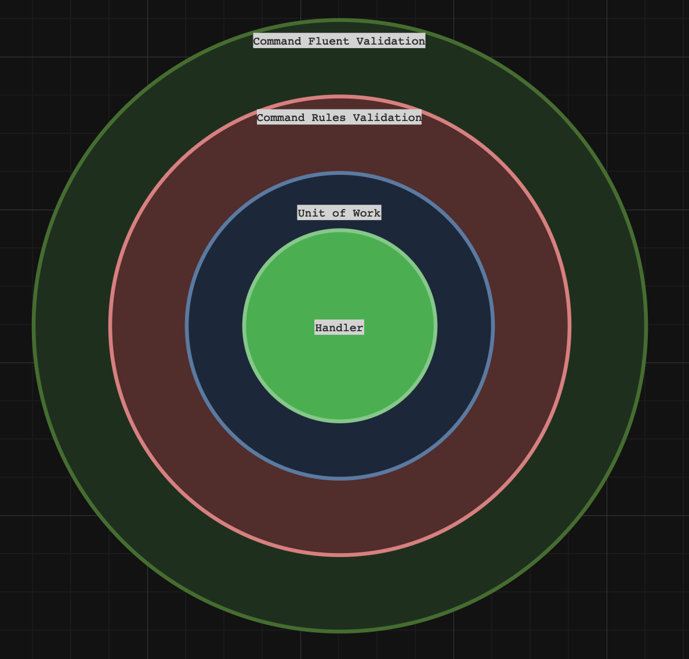
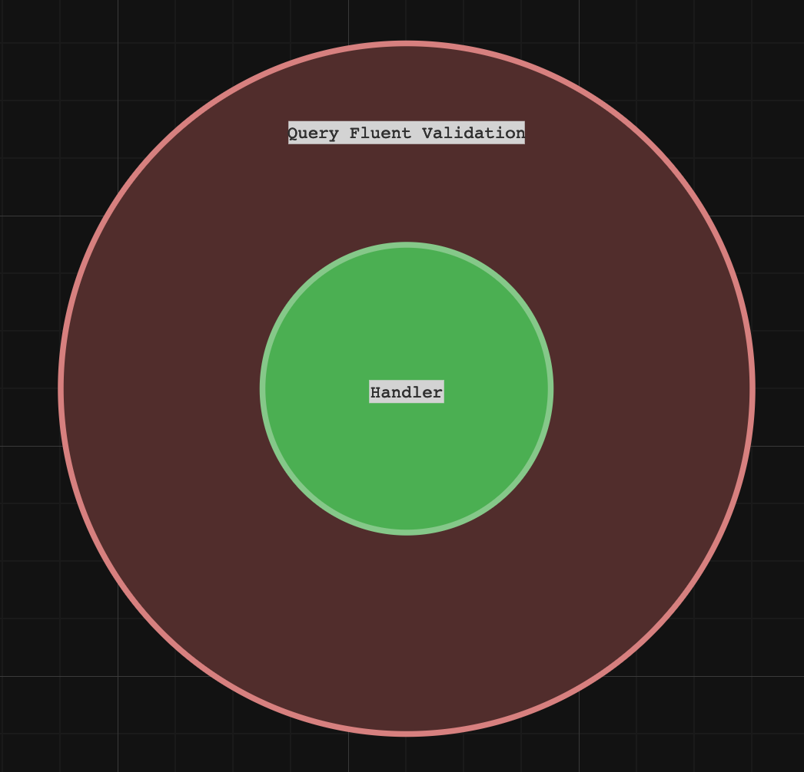
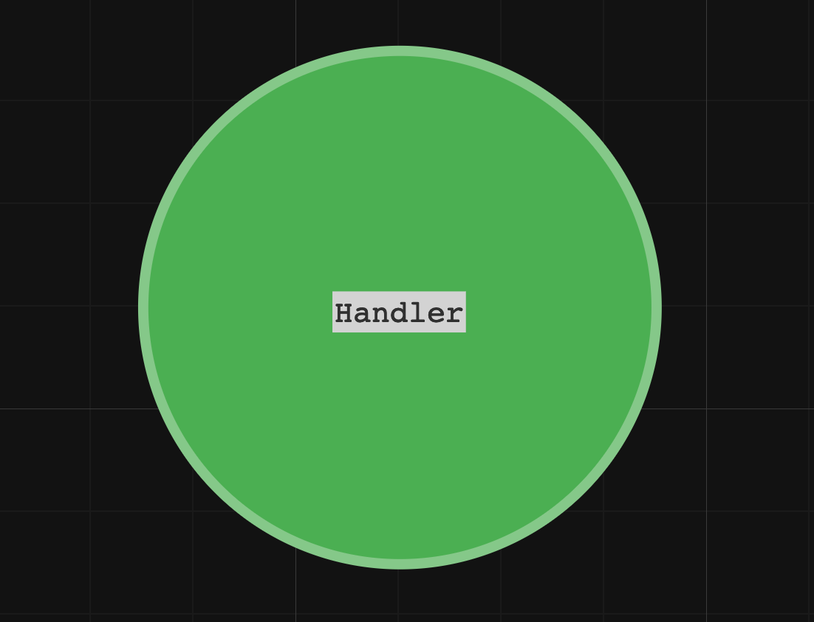

# Commands, Queries, and Domain Events

-----

Picture yourself embarking on a new project. You're aware that the application you're about to develop will be complex, so you've made a few key decisions:
- You'll be using the Clean Architecture design pattern.
- You aim to neatly segregate the code responsible for processing Queries and Commands.
- You'll be utilizing tactical Domain-Driven Design (DDD) patterns, including the use of Domain Events.

To accomplish this, you'll need to define three separate Pipelines, each tailored to a specific purpose.

## Command Pipeline

- Ensures that a given Command contains all the necessary fields for processing the request.
- Validates whether the application layer's required rules are satisfied.
- Command handlers must operate within a transactional context.

Here's how to implement it:

- [Interfaces](../examples/CleanArchitecture/Pipelines.CleanArchitecture/Pipelines.CleanArchitecture.Abstractions/Commands/)
- [Decorators](../examples/CleanArchitecture/Pipelines.CleanArchitecture/Pipelines.CleanArchitecture.Infrastructure/Commands/Decorators/)
- [Pipeline configuration](../examples/CleanArchitecture/Pipelines.CleanArchitecture/Pipelines.CleanArchitecture.Infrastructure/Commands/Extensions.cs)
- [Example command implementation](../examples/CleanArchitecture/Pipelines.CleanArchitecture/Pipelines.CleanArchitecture.Application/Commands/CreateToDo/)

## Query Pipeline

- Ensures that the Query data includes all the required fields for processing the request.

Here's how to implement it:

- [Interfaces](../examples/CleanArchitecture/Pipelines.CleanArchitecture/Pipelines.CleanArchitecture.Abstractions/Queries/)
- [Decorators](../examples/CleanArchitecture/Pipelines.CleanArchitecture/Pipelines.CleanArchitecture.Infrastructure/Queries/Decorators/)
- [Pipeline configuration](../examples/CleanArchitecture/Pipelines.CleanArchitecture/Pipelines.CleanArchitecture.Infrastructure/Queries/Extensions.cs)
- [Example query implementation](../examples/CleanArchitecture/Pipelines.CleanArchitecture/Pipelines.CleanArchitecture.Infrastructure/Queries/Handlers/)

## Domain Event Pipeline

- Dispatcher should not create its own Dependency Injection scope (it should be inherited from parent, in that case, from Command Dispatcher)

Here's how to implement it:

- [Interfaces](../examples/CleanArchitecture/Pipelines.CleanArchitecture/Pipelines.CleanArchitecture.Abstractions/DomainEvents/)
- [Pipeline configuration](../examples/CleanArchitecture/Pipelines.CleanArchitecture/Pipelines.CleanArchitecture.Infrastructure/DomainEvents/Extensions.cs)
- [Example domain event implementation](../examples/CleanArchitecture/Pipelines.CleanArchitecture/Pipelines.CleanArchitecture.Application/DomainEvents/)