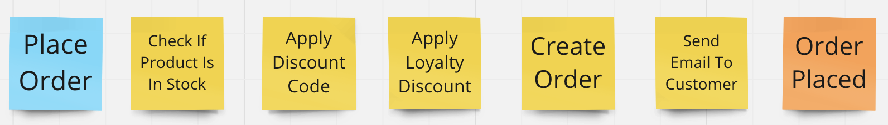

# Multistep process with Pipelines

-----

Imagine you want implement make an order feature. But it's not so simple because:

- You need to check if the product is still available.
- If you have a discount code, you want to use it.
- If you're a loyal customer, you should get a loyalty discount.
- And once your order is placed, you should get an email confirming it.

Pipelines allows you to easily create a dedicated Pipeline for this process, in which you will be able to control the order in which individual process steps are invoked.

Discounts are created separately, not where you create the order. To use these discounts when you place an order, you have two options:

1. You can pass the list of discounts as a method parameter when you're making the order.
   - [See code here](../examples/ProcessPipeline/Pipelines.ProcessExample/Pipelines.ProcessExample/PlaceOrderProcess/MethodWithDiscountListAsParameter/)

2. You can use a shared object that's available for a single order. This way, the handler responsible for creating the order can access the discounts.
   - [See code here](../examples/ProcessPipeline/Pipelines.ProcessExample/Pipelines.ProcessExample/PlaceOrderProcess/WithSharedState/)
